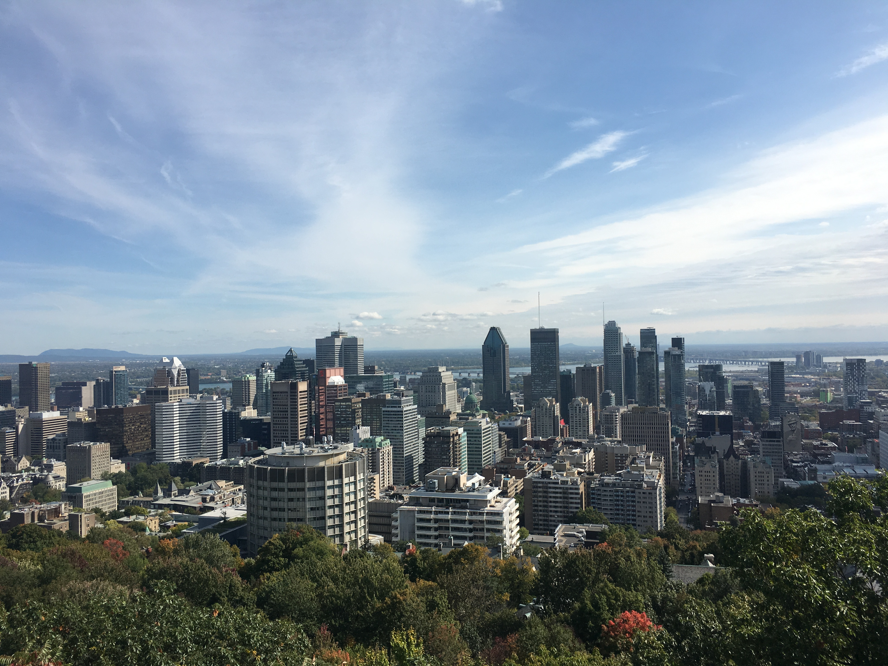
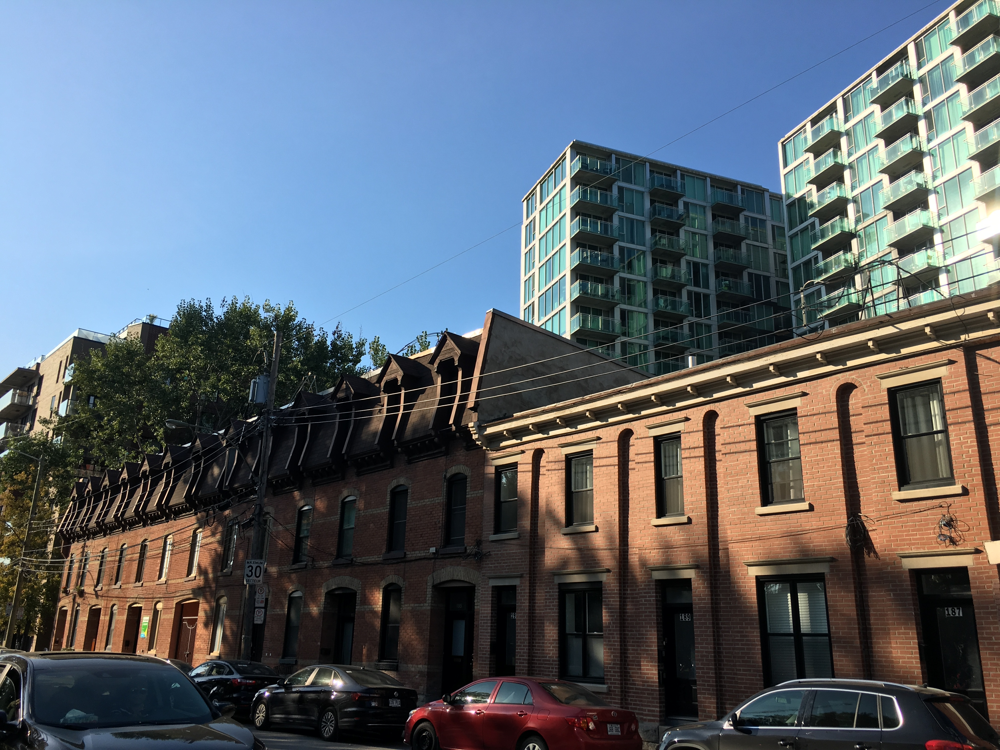

Last week, we presented some of the recurring themes emerging from our interviews with short-term rental operators in Montréal, with a focus on [hosts' *motivations* to enter the market and expand their businesses](post/str-hosts-part-1).

As a follow-up to that post, this piece discusses hosts' *perceptions*: their perceptions of the local STR market, of their own roles within it, and of the surrounding social and political discourse. As with the previous post, we include anonymous quotations from interviews to highlight these key points.

Credit: Charlotte Belot

 

### STRs as a stimulant to neighbourhood economies

Many hosts feel that their short-term rental operations are creating jobs and improving local neighbourhood economies, because their guests spend money in neighbourhoods outside of the downtown core, and because their businesses often depend on property managers, cleaners, and other employees.

> “We want it to be an opportunity to stimulate the economy in the neighbourhood as well. So a lot of the people, actually, end up exploring the neighbourhood, which is kind of cool. And we feel good about that.” 

> “People come to Montreal, they’re happy for the stays, we’re giving more jobs. People like the property manager, he has a job now. Cleaners, they’re working so we’re providing more jobs and this is just part of our business.”

> “You want them to stay in the neighbourhood so that they can give back to the neighbourhood as well.”

> “It’s got great benefits for the city. [...] We’ve accommodated over 10,000 guests just in Little Italy from the beginning of this break. So think about the influx and tourism that this brings to all the businesses around. It’s good for business, it’s good for the community. People love it.”

> “So the people that are going there are trying out the different things in the neighbourhoods. So they’ll go to the grocery store, they’ll go to the restaurants, they’ll go out more.”

Contrary to what these hosts argue, empirical research has been at best mixed as to the potential economic benefit STRs bring to neighbourhoods; the most comprehensive recent overview concluded that "the economic costs Airbnb imposes likely outweigh the benefits" ([Bivens 2019](https://www.epi.org/publication/the-economic-costs-and-benefits-of-airbnb-no-reason-for-local-policymakers-to-let-airbnb-bypass-tax-or-regulatory-obligations/)). As one small-time host pointed out, 

> “It’s actually really bad for the economy in that it’s your regulars that keep the business open. Right? [...] It’s the regulars that keep things going but tourism is a bump. And it’s good, but it’s a bump. And you can’t live on a Thursday, Friday, Saturday bump. Because there’s no one in my neighbourhood right now because there are fewer humans, fewer humans in the park. Tuesday at the park should be crowded, super crowded, and I know lots of times it’s just tourists. They assume you’re tourists too.”

 

### STRs are more work for landlords than traditional rentals

Many operators, especially those with mixed real-estate portfolios (both long-term and short-term rentals), mentioned that short-term rentals require a more hands-on, continuous approach to maintenance and other issues. While some prefer STRs for this very reason (they allow for more regular access to the housing units, allowing for maintenance and renovation on the landlord’s timeframe), others note that the labour-intensivity of the STR model can be taxing. 

> “A landlord typically will just rent out and maybe once a year, hear complaints. [...] This takes a lot more than being a landlord. This takes a lot of hospitality services and other type of scheduling.”

> “And in return, with my lease, I guarantee not only that my checks are going to clear the first of every month. We do weekly maintenance on our properties; it's in our best interests. Nothing ever breaks, and if they break, they're fixed right away. I don't bother you because I can't wait for you. And your taxes are being paid.”

> “I like the idea of having something I don’t have to take care of all the time. I would like to be able to re-rent them normally.”

> “With long term property management there is...no headache. [...] You know, you're dealing with a lot of turnover with short-term rentals.”

> Subject 1: It's demanding, you know? So it's not like you're signing a 12-month lease with someone, and then forgetting about them. It requires a lot of attention to detail.
> Subject 2: Hospitality never sleeps. If you're in the industry you're always on.
> Subject 1: So yeah, it's a lucrative business but it's also, you *deserve* that extra...you know?
> Subject 2: Moving from a nine-to-five to something like this, it's completely a shift. Where it's like six 'o clock and five 'o clock, you know, at the end of the day I can leave all my work, and I'll be there on Monday. You can't leave anything. It's going to follow you throughout the night literally.

Credit: Charlotte Belot

 

### Skepticism of Airbnb’s contribution to the housing crisis

Empirical research has demonstrated unamibiguously that STRs are removing housing from the long-term market, and consequently driving up rents and housing prices while lowering housing availability. One major study estimated, for instance, that the growth of Airbnb in recent years has been responsible for [one fifth of all the rent increases in the United States](https://hbr.org/2019/04/research-when-airbnb-listings-in-a-city-increase-so-do-rent-prices) ([Barron et al. 2019](https://papers.ssrn.com/sol3/papers.cfm?abstract_id=3006832)). The hosts we interviewed, however, generally rejected these arguments. Either hosts do not believe that they are “stealing” housing from long-term residents, or they don’t believe that the conversion of apartments to STRs is happening at a scale significant enough to contribute to rising rents.

> “Airbnb I'm sure has a contribution into it, but I don't think it's significant.”

> “I hear it’s very difficult for people to find apartments in this borough, NDG [Notre-Dame-de-Grâce—Côte-des-Neiges], because everything’s super expensive. [...] However, there are relatively few Airbnbs in NDG. There are not that many. I think most of them are in the Plateau area? [...] There are not that many here. So I don’t think that Airbnb or short-term rental are having an effect on this borough.”

> “We just get a lot of scrutiny from a lot of people, saying that we are the reasons why people cannot rent anymore in these areas, and I beg to differ. Because the people that are renting those units would rent them to anyone, and they’d be giving them the same amount of money that we would be giving them.”

> “The people, especially in the Plateau, saying that we’re stealing their apartments, we’re not. They wouldn’t be able to afford them anyway. [Referring to Little Italy] If you look at affordable housing in the area, this is not a place to live truly on 600 bucks a month. I lived here 10 years ago, and I had to sacrifice. And now, forget renting where I was living, because I can’t even afford it anymore.”  

In the same vein, during an informal phone call we conducted with a prominent short-term rental company, a high-level manager in Montreal also stressed that the company admits no responsibility for housing loss, despite the company’s large rental portfolio and well-publicized practice of signing leases on existing residential apartments in order to convert them to STRs. 

 

### A perceived divide between large and small AirBnB operators 

STR operators, regardless of scale, almost always note that there are bigger players in the market that constitute “the real problem.” While it is true that a single large hospitality companies such as [Sonder](sonder.com) have a more significant impact on housing than a single independent operator of one STR, representatives of large companies, some with almost 100 listings, also shifted blame to even larger actors in the market, some of which operate illegally and are thus considered more of a problem. 

> “All of us have a lot to lose. I know that they’ve never issued a fine as of yet. We have a lot to lose in the sense that we’re not billionaires like Sonder or companies that have like a bajillion dollars and they’re born into money.”

> “What I’m really up against is people that have a huge number of them and they’re the problem. People buying a 12-plex, or not even people, a company buying a 12-plex and kicking everyone out. That’s a problem.”

> “We're not like the big companies.” - a representative of a company with about 100 listings 

Credit: Charlotte Belot

 

### Home-sharing as a tool to combat housing unaffordability and economic precarity

Another emerging theme is a tension between the potential financial assistance which home sharing can afford to middle-class homeowners and renters (and to some extent smaller landlords) facing their own housing affordability challenges, and the exploitation of attractive neighbourhoods by large hospitality companies. Smaller hosts expressed the concern that regulating the industry with costly permits and long wait times might make legal home sharing inaccessible to those who would benefit most from its original purpose and reserve it for actors that have the financial resources to pay for these costs. 

Many hosts defended small-time home sharing practices, such as sharing a principal residence while the usual occupants are away, or renting out the upstairs unit of a duplex occupied by the host. 

> “Don’t even make them pay the hotel tax. They’re managing to pay for a normal twenty-first century life. Just hanging on to the middle class, like paying for your daycare.” 

> “That’s how people are surviving in a worsening economy where the rich have gotten richer and a much smaller percentage of people are trying to still live downtown.”

> “The person who is able to sacrifice everything to buy that building is now able to make their payments to the bank. Because that's why people buy [real estate]. They don't buy because they could afford the mortgage payments, they buy it so other people pay their mortgage. [...] In this day and age where people's retirements, a lot of the times, depend on real estate, it's how we make up morale.”

> “It’s cool, I don’t know, you could lose your job tomorrow and you could start driving Uber with no experience and start renting out one of the rooms in your house. It’s a fine line; you don’t want to take money out of people’s pockets, and you don’t want to tell them how to live their lives. There’s a certain freedom aspect to it where it lets people do what they want to do, but then there’s also [the issue that] I didn’t buy a house so that I could live next door to a bunch of people that change every single night.”

 

### Slim profit margins

Many STR operators, especially those who operate legally and pay all fees and taxes, note the very slim profit margins associated with short-term rentals. This could call into question the feasibility of “home sharing” as a legitimate tool for supplementing income, if done legally in Montreal. 

> “So this year, we hit $2 million in gross revenue. We're projected to hit three next year. [...] Our expenses are 90% of that, because rent and insurance is insane.”

> “The margins are very small. 30 thousand is not a huge amount of profit. That's like one employee that would be gone, one more employee. So, we have to be very careful. But it's not losing money and people are working.”
 
> “Definitely not that much of a profit. [...] It's mainly just to pay what the house or what the property in downtown owes.”

> Subject 1: But that's not how much we're making in our pocket, it's just, it's the gross figure. Like our partners benefit more than anyone else.
> Researcher: Right. And I know the margins on these properties are always much thinner than...
> Subject 1: Yeah, with lots of costs.
> Subject 2: A lot of costs, that's what I was going to say, as well.
> Subject 1: The overhead is large.

 

### Awareness of poor enforcement 

Although the majority of our interview subjects claim to be operating legally or partially legally (i.e. with a combination of legal and illegal listings), some operators noted the lack of enforcement of the existing rules, and that this presents an incentive to operate illegally. Many legal operators expressed frustration that the thousands of hosts operating without the proper permits and zoning may never face consequences.  

> Researcher: 13,000, yeah, active listings in the Plateau. 
> Subject: So they’re going to add three more inspectors to catch us all? Good luck. 

> “That’s the problem, you know? So I heard, at one point, and when I had the CITQ [the provincial tourism regulatory agency] guy here, I said, ‘How many of you are there?’ And he said, ‘We were two, and now we’ve gone up to seven.’ And I was just like, ‘Well there’s no way.’”

> “I think the real issue is the not-legal ones. The ones that are just doing it without paying anyone. And I don’t know if [the CITQ has] the physical bodies to enforce any laws. Because I don’t know how they’re going to find all those.”

> “I know that they’ve never issued a fine as of yet.”

> “You can scare people, you can keep changing the law, but how are you going to reinforce let's say only Montreal, only over 5000 listings that we have, how are you going to really enforce that? People need money.”

### Trends and takeaways 

Most hosts expressed some level of skepticism that operations such as theirs (regardless of scale) could be partially responsible for Montreal’s housing crisis, even though our previous research strongly suggests that this is the case. Similarly, most had a sense that their work to bring tourism dollars into various residential areas was a benefit for these neighbourhoods, despite the fact that this idea is not well supported by existing research. Many hosts also exuded a sense of confidence that they would not be caught, or if they were, they would not face serious consequences. 

One surprise has been the readiness of our interview subjects to share their views on the politics surrounding the regulation of Airbnb. Most hosts believe in some regulation of STRs in Montreal, but, as a rule, believe that the rules should apply to some other, more problematic class of operator, leaving them the freedom to run their business as they desire. 

### Future directions for research

As we finish our interviews and begin to analyze the responses more systematically, we hope to glean more insights into the patterns and trends at work. Classifying our subjects more rigorously in terms of their relationship to their property (e.g. as hosts, hoteliers, or landlords) will help us to understand how their property management role relates to the number of units they operate, their backgrounds, and their business practices. I’d also like to develop a better understanding of the point at which an Airbnb operation becomes a full-time job: 5 listings? 10 listings? How is this relationship complicated by a host’s business style and the support services they employ? This is part of our attempt to develop a more robust definition and analytical description of the typical commercial Airbnb operator, if such a thing exists. 

Additionally, we’re interested in testing some of the perceptions that are common to the majority of hosts, such as the idea that Airbnbs are a stimulant to neighbourhood businesses. More broadly, I want to understand to what extent commercial operators’ self-perceptions are based in fact, and to what extent they represent instances of motivated reasoning.

Finally, it would be interesting to conduct some comparative analysis with other major cities to understand how the experiences of landlords factor into the decision to host on Airbnb in other contexts. For example, in a city where landlords are perceived to have more power over tenants, are there fewer landlords turning to Airbnb? In those cases, since we know Airbnb is prevalent in all major cities, are there more operations run by tenants and homeowners? 

As always, there remains no shortage of questions to pose about the role of the sharing or gig economy in our society generally, and about the experiences of commercial Airbnb enterprises in Montreal specifically. A huge benefit of these interviews has been the chance to learn from and hear the perspectives of our interviewees firsthand. In an area of research that is in its early stages and is often dominated by quantitative data analysis (so far), the opportunity to connect with the people behind the listings was refreshing and highly valued.