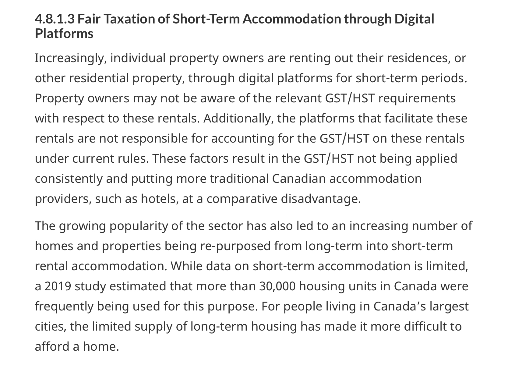

We are happy to share that our research on the housing impacts of short-term rentals and Canadian markets, recently published in the Canadian Journal of Urban Research, was cited in the Canadian federal government's 2020 Fall Economic Statement. 

From the 2020 Fall Economic Statement

 

You can access the full report [here](http://cjur.uwinnipeg.ca/index.php/cjur/article/view/274), read our blog post [here](/2019/06/20/short-term-rentals-in-canada-paper/), and download the Fall Economic Statement [here](https://www.budget.gc.ca/fes-eea/2020/home-accueil-en.html). 