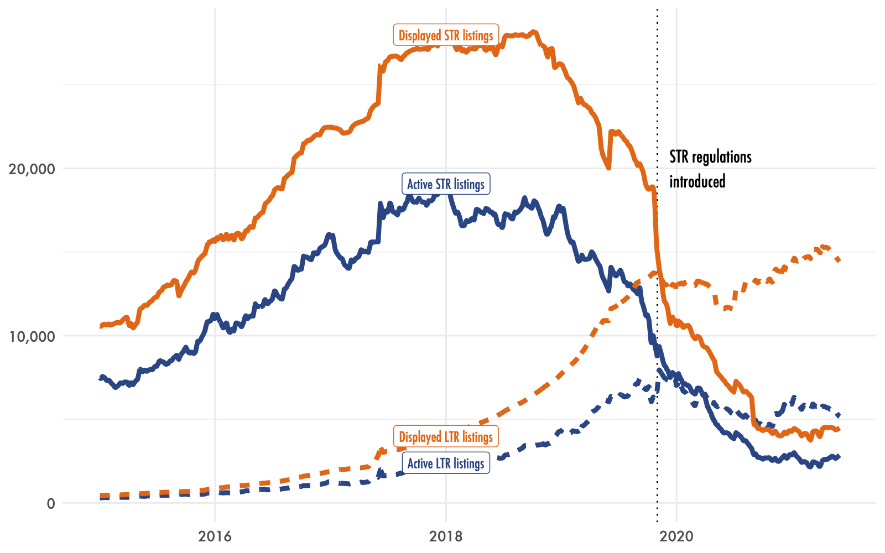
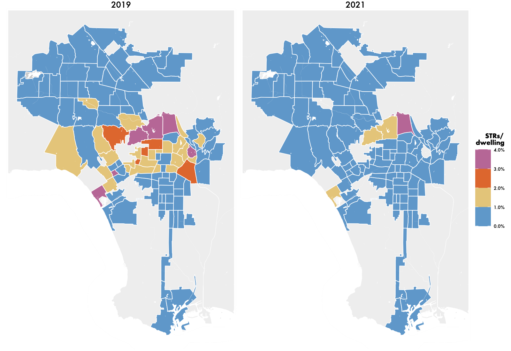
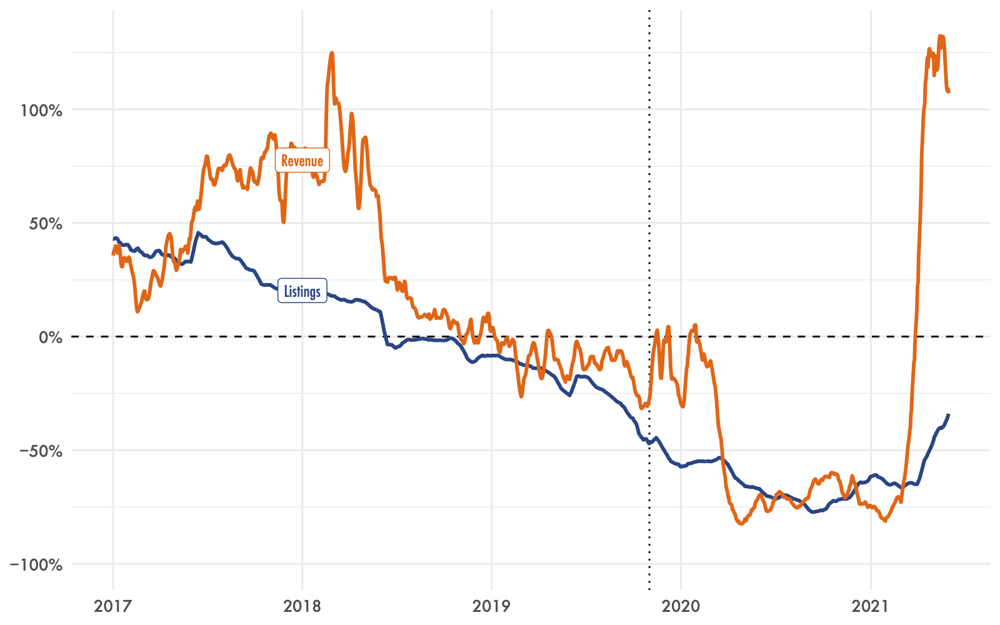
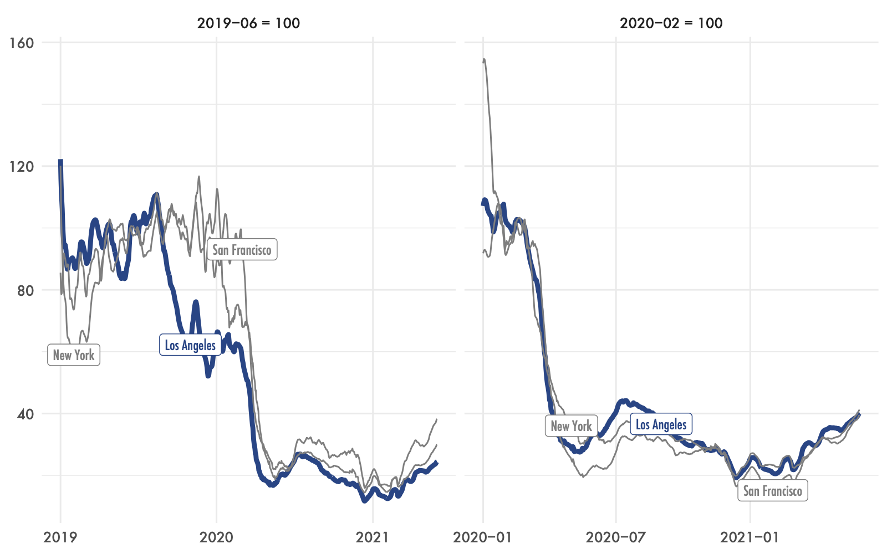
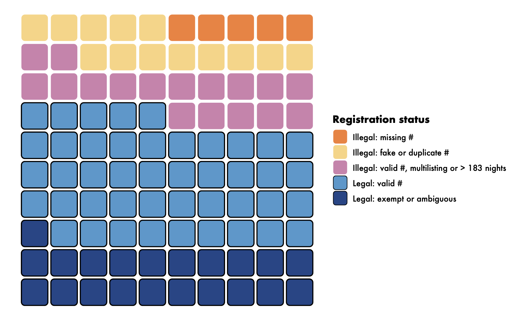
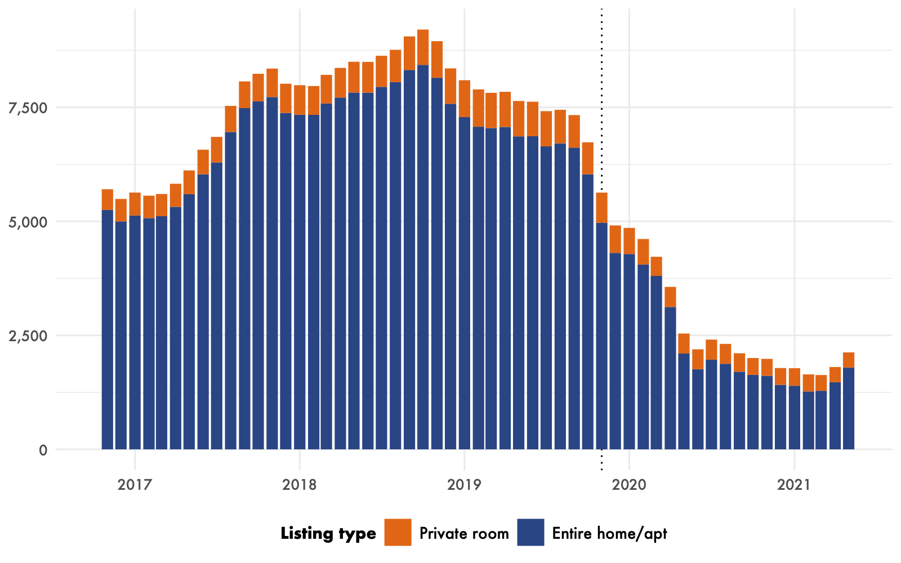
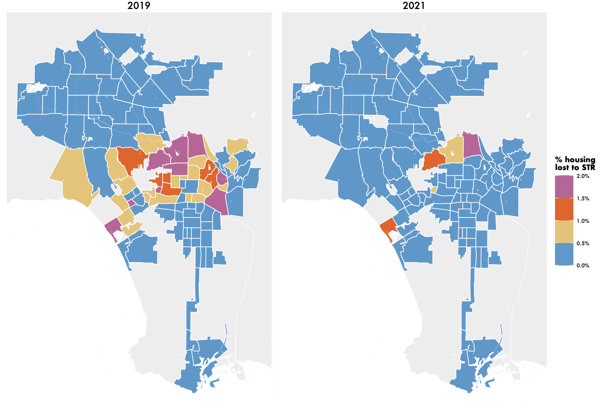
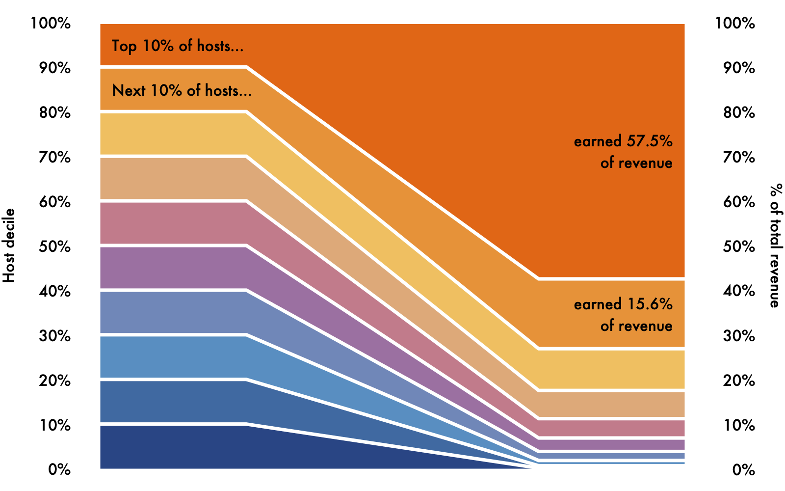

On November 1, 2019, the City of Los Angeles began enforcing its Home-Sharing Ordinance (HSO), which had previously been but ignored. The HSO restricts short-term rentals (STRs, defined as rentals of fewer than 31 days at a time) to a host’s principal residence, forbid rentals of rent- stabilized units, and limit most listings to 120 nights reserved per year.

Shortly after the regulations took effect, UPGo researchers undertook a brief analysis of their early impacts (Wachsmuth, D., 2019, “STRs in Los Angeles: Are the Nov. 2019 regulations being enforced?”). In the 18 months since then, the COVID-19 pandemic dramatically curtailed travel, and hence STR activity. In light of the pandemic, and the fact that the regulations have been actively enforced for more than a year and a half, in this brief report we revisit the state of Los Angeles’ STR market, and provide evidence as to the effectiveness of the City’s STR regulations. We ask and answer the following questions:

- What caused the drop in STR listings in Los Angeles since 2020?
- How many STR listings in Los Angeles are operating illegally?
- What impact have STRs had on housing availability in Los Angeles?

The report is [available for download](/publication/strs-in-los-angeles-2021) as a PDF; below I summarize the findings.

### What caused the drop in STR listings in Los Angeles?

In 2019 there was an average of 12,620 active daily STR listings in Los Angeles operated by an average of 7,380 hosts (Figure 1). In the midst of the Covid pandemic, active daily listings decreased to 4,380 in 2020, and to 2,550 across the first five months of 2021. These 2,550 listings still active on average each day in 2021 were operated by an average of 1,610 hosts, for an average revenue of $24,600 per active listing or $39,000 per active host in the first five months of the year. The same time period has witnessed a clear shift from “STR” to “LTR” listings on Airbnb and Vrbo. This shift has largely occurred through the imposition of 30-day minimum rental periods on Airbnb for several thousand listings in October 2019 (right before enforcement of the HSO was scheduled to begin) and in August/September 2020 (when the City gained new abilities to report unregistered listings to Airbnb). However, even though LTR listings now outnumber STR listings in Los Angeles, the latter are still responsible for the vast majority of total platform revenue: $62.8 million in STR revenue versus $27.6 million in LTR revenue in 2021 so far.

Figure 1. Active daily STR listings in the City of Los Angeles (7-day average)

STR activity in Los Angeles is highly concentrated in the Venice, Downtown and Hollywood neighborhoods. These three areas accounted for a quarter of all listings and listings revenue in 2021. Venice and Hollywood Hills West have by far the most STR activity when measured in per-capita terms. In 2021, even in the face of a dramatic decrease in STR listing counts, active STR listings accounted for 1.4% of all of Venice’s housing units, while the equivalent figure for Hollywood Hills West was 1.9% (Figure 2). In 2019, prior to the pandemic, the respective figures were 5.2% and 6.1%.

Figure 2: Active STRs as a share of all dwelling units in Los Angeles by neighborhood in 2019 (L) and 2021 (R)

#### The timing of the STR activity decline

What explains the dramatic decrease in STR listings between 2019 and the present? Two events could each plausibly have contributed to this shift: the City of Los Angeles’ move to begin actively enforcing its STR regulations in November 2019, and the outbreak of the COVID pandemic from March 2020 onward. To adjudicate between these two possibilities, we examine the precise timing and character of the decline in STR activity, and compare Los Angeles with peer jurisdictions which did not undergo new regulations in the same time period.

Active daily listings peaked in December 2017 at 19,490, and began to decline in early 2019 before dropping sharply in advance of the City’s announced beginning to active regulatory enforcement in November 2019. We have previously demonstrated that this decline was caused by Airbnb pre-emptively removing several thousand non-compliant listings in October 2019 (Wachsmuth, D., 2019, “STRs in Los Angeles: Are the Nov. 2019 regulations being enforced?”). By contrast, revenue growth did not change in the wake of the City’s regulatory enforcement (Figure 3), which indicates that the City’s rules did not have a significant impact on total STR activity, despite the disappearance of several thousand listings.

Figure 3: Change in daily active listings and host revenue compared to one year earlier (14-day average)

The COVID-19 pandemic, by contrast, sent Los Angeles’ STR market into collapse, with both listing and revenue growth tilting sharply negative as of March 2020. As of early 2021, year-over- year revenue growth has once again become highly positive, signalling a rapid recovery in the STR market (Figure 3).

#### Comparison with peer jurisdictions

On its own terms, the trajectory of STR activity in Los Angeles strongly suggests that the City’s move to enforce its own regulations has not been responsible for a substantial portion of the recent decline in STR activity in the city. A second way to answer this question is to compare Los Angeles’ STR market trajectory with the trajectories of peer cities which have not had a change in regulatory environment but which have also been affected by the COVID-19 pandemic. Figure 5 compares total STR reservations per month among Los Angeles, New York City and San Francisco. The left panel of the figure demonstrates that Los Angeles did experience a pre-pandemic decline in reservations, from September 2019 through February 2020, which New York and San Francisco did not. This is the time period during which Airbnb removed several thousand listings in Los Angeles, and it is plausible to attribute the difference between Los Angeles and the other cities in this period to the mass removal.

Figure 5. Indexed daily reservations in Los Angeles, New York City and San Francisco (14-day average)

Since the start of the pandemic, however, Los Angeles’ STR market has performed almost exactly in line with its peer cities. The balance of evidence strongly suggests that Airbnb’s mass removal of listings in late 2019 produced a one-time decline in STR activity in the months prior to the pandemic, but that there has been no discernible impact of Los Angeles’ regulatory enforcement in the year and a half since. The decline in STR activity in Los Angeles over the last year and a half can be almost entirely attributed to the COVID-19 pandemic. This implies, conversely, that, when the pandemic-induced collapse in travel demand comes to an end, STR activity in Los Angeles will quickly return to its former level.

### How many Los Angeles STR listings are illegal?

In order to be operating legally, an STR listing in Los Angeles must 1) be registered with the City, and 2) must be operated in line with a set of restrictions, notably a principal residence requirement and in most cases an annual limit of 120 nights of reservations. According to our analysis, 1,490 (35.1%) of Los Angeles’ currently active 4,240 STR listings are illegal, more than a year and a half since the City claims to have begun actively enforcing its laws (Figure 6) . 4.7% of listings have no license number, while 40.7% of listings with a displayed license number are operating illegally (either because the number is a fake or a duplicate, or because they are not operating out of a principal residence for fewer than than 183 nights a year).

Figure 6. All Los Angeles STR listings by legality and registration status (late June 2021; each square is 1% of all listings)

### STR-induced housing loss

In September 2019, before the City began to enforce the HSO, there were 6,620 FREH listings in the City of Los Angeles, and 680 more housing units which were operating as ghost hostels. In total, therefore, short-term rentals were removing 7,300 housing units from Los Angeles’ long-term market (Figure 7). Airbnb’s removal of several thousand non-compliant listings magnified the usual seasonal decline in STR-induced housing somewhat over the next several months, as did the conversion of a number of STR listings to 30-day minimum stays, but on the eve of the pandemic there were still nearly 5,000 housing units being operated as dedicated short-term rentals. This figure plummeted during the pandemic, and after bottoming out at 1,600 in March 2021, it has begun to increase again. In the last two months, dedicated STRs increased by almost a third, and as of May 2021, 2,120 housing units are being operated as dedicated STRs.

Figure 7. Housing units converted to dedicated STRs in the City of Los Angeles (monthly average)

The 2,120 housing units taken off of Los Angeles’ housing market by STRs at the moment is only 0.14% of the total amount of housing in the city, but this housing loss has been concentrated in a small part of the city. Figure 8 shows the proportion of each neighborhood’s housing stock which was operated as a dedicated short-term rental as of May 2019 and May 2021. The maps show a tale of two cities: in most of Los Angeles, there are relatively few dedicated STRs, while in Venice and the central city they are ubiquitous. In May 2019, 3.9% of all housing units in Venice were operating as dedicated STRs, and that number was still 1.2% in May 2021, despite the pandemic.

Figure 8. The percentage of housing units operating as dedicated STRs in the City of Los Angeles by neighborhood, in 2019 (L) and 2021 (R)

#### Inequality in the Los Angeles STR market

Among all the STR hosts who earned revenue in Los Angeles last year, the median revenue was $8,400, while there were 27 hosts or host networks that earned more than $500,000 in 2020. Figure 10 shows the percentage of the total $178.2 million in STR revenue in 2020 which accrued to each decile of hosts. The most successful 10% of hosts earned more than half (57.5%) of all STR revenue. The revenue concentration is even steeper among the top 10%: the top 5% earned 43.6% of revenue, while the top 1% of hosts earned 20.6% of all revenue.

Figure 10. STR host revenue distribution in the City of Los Angeles (2020)

### Acknowledgments

This research was commissioned and funded by Better Neighbors LA, with supplementary funding provided by SSHRC Insight Grant #435-2019-0720. The author is exclusively responsible for all analysis, findings, and conclusions. 

---

'Short-term rentals in Los Angeles: Are the City’s regulations working?' is [publicly available for download today](/publication/strs-in-los-angeles-2021).